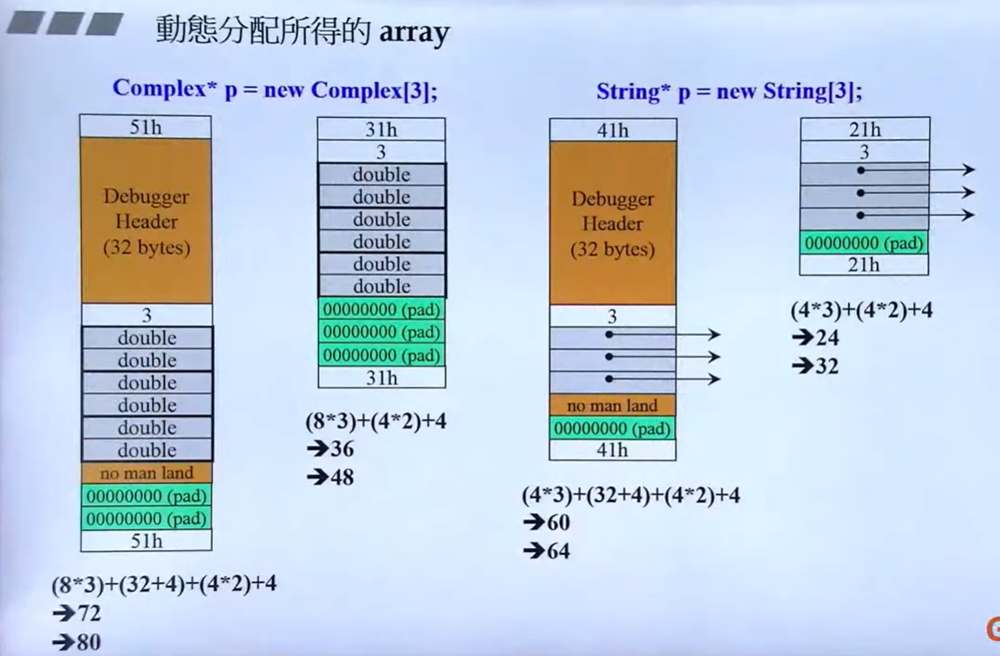
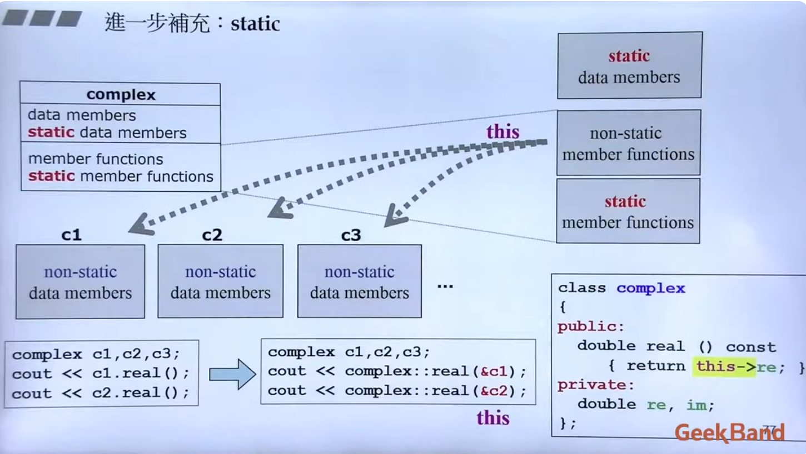
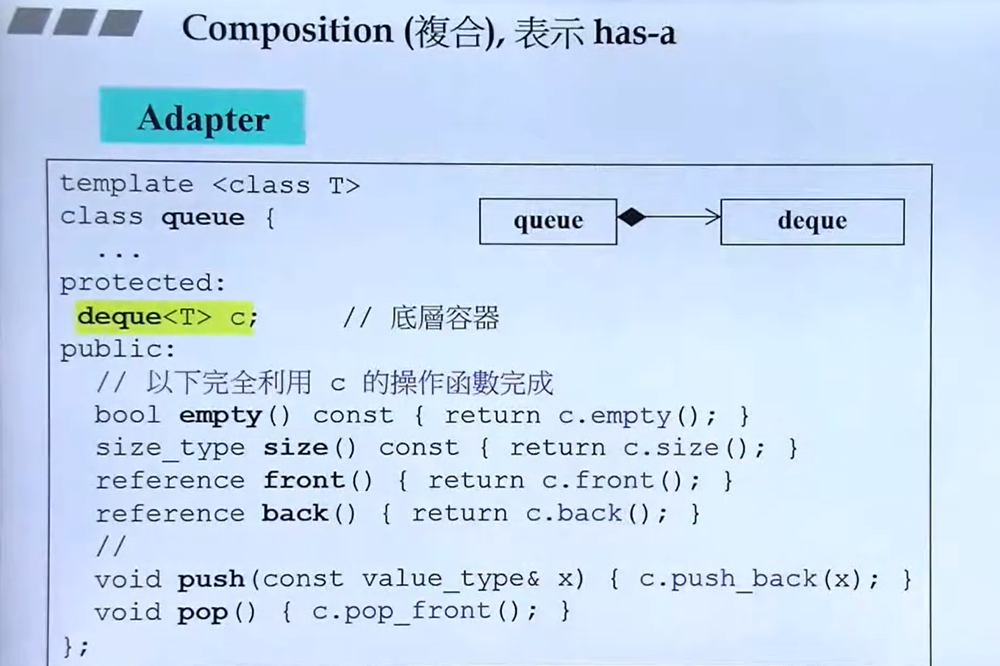
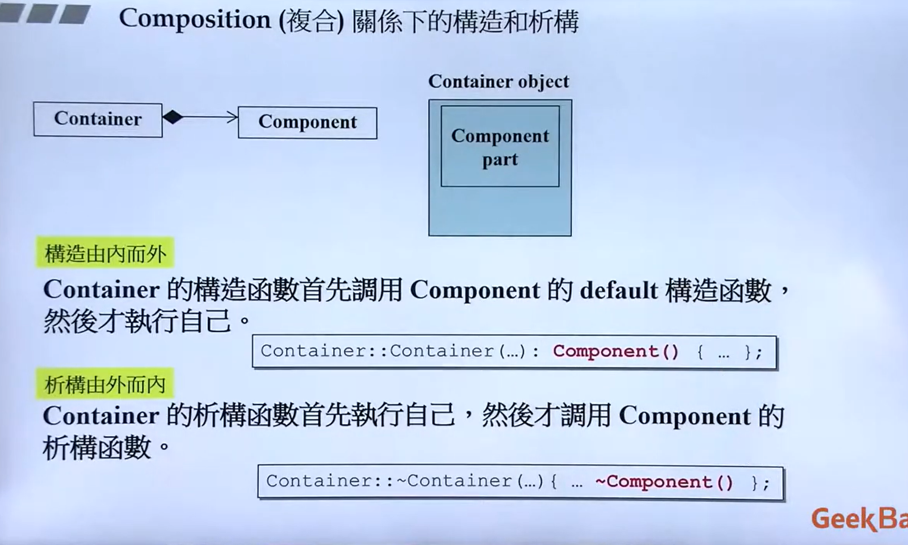
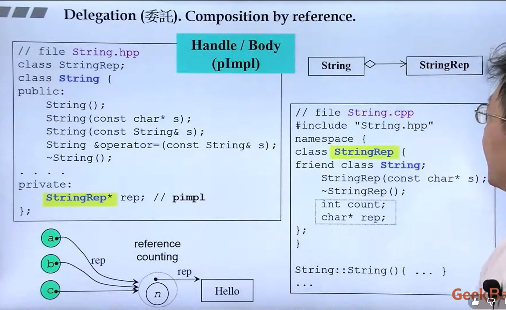
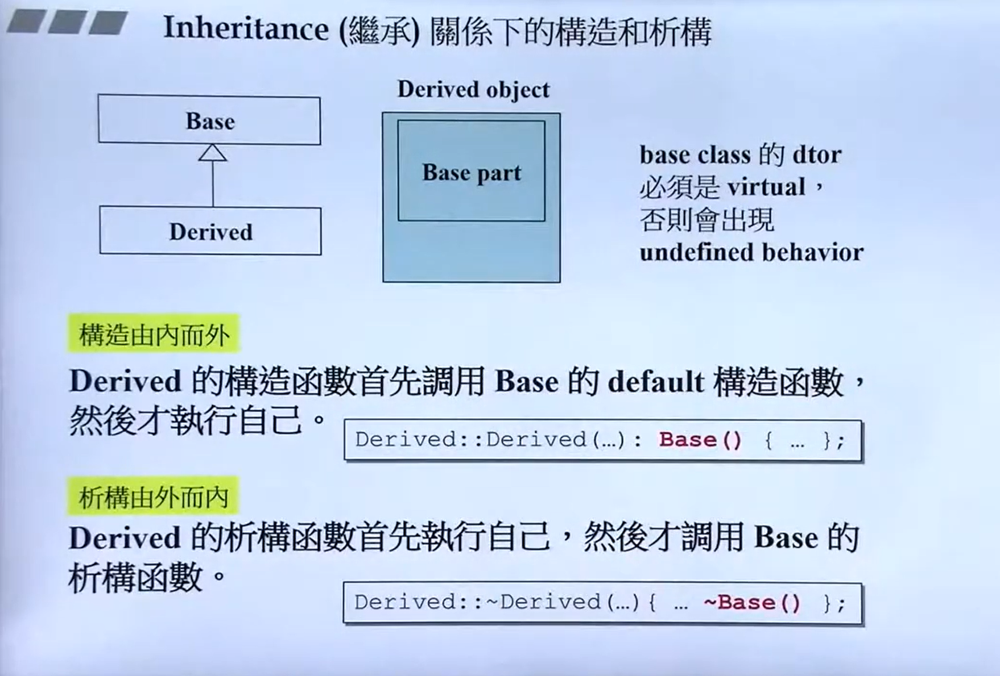
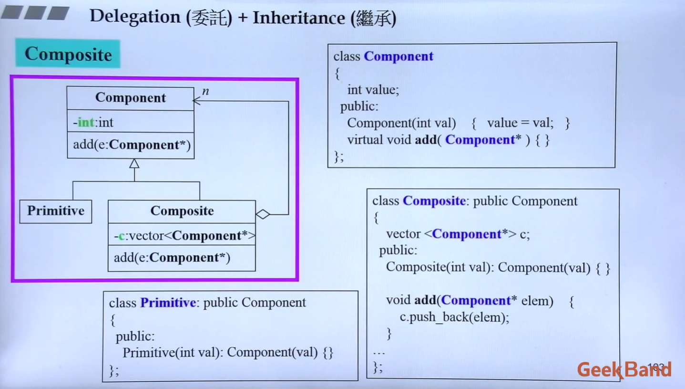

+ 视频直达：[C++面向对象高级编程上-基于对象和面向对象](https://www.bilibili.com/video/BV1Lb4y1R7fs)
+ 课程讲义下载直达：[slide](slide/)
+ 源代码直达：[code](code/)

----

候捷老师 C++ 系列课程导航：（编号顺序可作为学习顺序参考）

1. C++面向对象高级编程（上）-基于对象和面向对象
2. [C++面向对象高级编程（下）-兼谈对象模型](../C++-OOPBase2-HouJie/)
3. [C++标准库(STL)与泛型编程](../C++-STL-HouJie/)
4. [C++新标准-C++11/14](../C++-newC++11&14-HouJie/)
5. [C++内存管理](../C++-MemoryManagement-HouJie/)
6. [C++Startup揭秘](https://github.com/19PDP/Bilibili-plus)


---

## 课程简介

这是侯捷老师的所有C++技术课程中最基础最根本的一门课。

C++可说是第一个高度普及的Object-Oriented（面向对象）程序语言。“第一个”
或“最早的”并非重点，重点是经过多年的淬炼和考验C++的影响深入各层面，
拥有众多使用者和极其丰富的资源（书籍、论文、期刊、视频、第三方程序库…）。

作为Object-Oriented（面向对象）技术的主流语言，C++其实还拥有另一支编程
主线：模板与泛型编程（Templates and Generic Programming）。

本课程涵盖上述两条主线：Object-Oriented（面向对象）和泛型编程（Generic
Programming）。

由于视频录制时程的因素，本课程分为Part I和Part II.
Part I主要讨论OO（面向对象）的基础概念和编程手法。基础最是重要，勿在浮
沙筑高台，着重的是大器与大气。课程首先探讨Class without pointer members
和Class with pointer members两大类型，而后晋升至OOP/OOD，包括classes之
间最重要的三种关系：继承（Inheritance）、复合（Composition）、委托（Delegation）。
Part II继续探讨更多相关主题，并加上低阶的对象模型（Object Model），以及高
阶的Templates（模板）编程。

本课程所谈主题都隶属C++1.0（C++98）；至于C++ 2.0（C++11/14）带来的崭新
内容则由侯捷老师的 [另一门课程](../C++-newC++11&14-HouJie) 程涵盖。C++2.0在语言和标准库两方面都带来了很多新
事物，份量足以形成另一门课程。

你将获得整个video课程的完整讲义（也就是video呈现的每一张投影片画面），
和完整的示例程序。你可以（也有必要）在学习过程中随时停下来思考和阅读讲义。

> 侯捷简介：程序员，软件工程师，台湾工研院副研究员，教授，专栏主笔。曾任
> 教于中坜元智大学、上海同济大学、南京大学。著有《无责任书评》三卷、《深
> 入浅出MFC》、《STL源码剖析》…，译有《Effective C++》《More Effective C++》
> 《C++ Primer》《The C++ Standard Library》…


---

以下这份不太细致的主题划分，帮助您认识整个课程内容。

## C++面向對象編程 (C++Object-Oriented Programming)

### Part I

**Introduction of C++98, TR1, C++11, C++14**<br>
&emsp;Bibliography<br>
&emsp;Data and Functions, from C to C++<br>
&emsp;Basic forms of C++ programs<br>
&emsp;About output<br>
&emsp;Guard declarations of header files<br>
&emsp;Layout of headers<br>
&emsp;Object Based<br>
&emsp;Class without pointer member<br>
&emsp;&emsp;Class declarations<br>
&emsp;&emsp;Class template, introductions and overviews<br>
&emsp;&emsp;What is 'this'<br>
&emsp;&emsp;Inline functions<br>
&emsp;&emsp;Access levels<br>
&emsp;&emsp;Constructor (ctor)<br>
&emsp;&emsp;Const member functions<br>
&emsp;&emsp;Parameters : pass by value vs. pass by reference<br>
&emsp;&emsp;Return values : return by value vs. return by reference<br>
&emsp;&emsp;Friend<br>
&emsp;&emsp;Definitions outside class body<br>
&emsp;&emsp;Operator overloading, as member function<br>
&emsp;&emsp;Return by reference, again<br>
&emsp;&emsp;Operator overloading, as non-member function<br>
&emsp;&emsp;Temporary objects<br>
&emsp;&emsp;Expertise<br>
&emsp;&emsp;Code demonstration<br>
&emsp;class with pointer members<br>
&emsp;&emsp;The "Big Three"<br>
&emsp;&emsp;&emsp;Copy Constructor<br>
&emsp;&emsp;&emsp;Copy Assignment Operator<br>
&emsp;&emsp;&emsp;Destructor<br>
&emsp;&emsp;Ctor and Dtor, in our String class<br>
&emsp;&emsp;"MUST HAVE" in our String class<br>
&emsp;&emsp;&emsp;Copy Constructor<br>
&emsp;&emsp;&emsp;Copy assignment operator<br>
&emsp;&emsp;Deal with "self assignment"<br>
&emsp;&emsp;Another way to deal with "self assignment" : Copy and Swap<br>
&emsp;&emsp;Overloading output operator (<<)<br>
&emsp;&emsp;Expertise<br>
&emsp;&emsp;Code demonstration<br>
&emsp;Objects from stack vs. objects from heap<br>
&emsp;&emsp;Objects lifetime<br>
&emsp;&emsp;new expression : allocate memory and then invoke ctor<br>
&emsp;&emsp;delete expression : invoke dtor and then free memory<br>
&emsp;&emsp;Anatomy of memory blocks from heap<br>
&emsp;&emsp;Allocate an array dynamically<br>
&emsp;&emsp;new[] and delete[]<br>
> 关于Aray new, Array delete, 做一些说明和补充
> 
> 
> 两个类对应的数组形式的内存分配图如图二所示，对于String类这样含有pointer的类，往往数组的每个元素都存放有指针。
> 在这种情况下如果没有使用array_delete删除元素（如图一所示），那么在delete的时候只会调用一次析构函数，对于String类数组第一个元素的后面的那些元素的指针指向的空间因为没有调用析构函数所以就没有进行回收，所以真正泄露的内存是在这些内存（也就是图1右下边打问号的地方）。
> 但是对于Complex这种不需要重载析构函数或者不带指针的类组成的数组，在最后的确可以不用使用`array delete`
> ```cpp
> // 类似于 Complex* p = new Complex[3];
> // delete[] p; //这个就是array delete 
> ```
> 因为当执行`delete p`的时候，就会直接将p所指的空间直接删除掉，而因为p对应的类没有带有指针，所以不需要执行析构函数删除数组每个元素指向的那片空间。也就是说不需要执行`array delete`，但是因为编程习惯的原因，不管会不会泄露内存对数组进行`delete`的时候，都需要使用`array delete`。

&emsp;MORE ISSUES :<br>
&emsp;&emsp;static<br>
> 
> static 修饰类中的成员变量，会使得这个变量编程所有对象都共用同一份数据，这份数据在内存当中只存在一份。
> static 修饰类中的成员函数，于一般的成员函数的区别在于调用这个带有`static`的成员函数是不会传递`this`指针的，所以它只能处理静态成员变量 **（普通成员函数在编译后，第一个参数实际上是隐藏的 this 指针。但静态成员函数没有这个隐藏参数。）**
> 

&emsp;&emsp;private ctors<br>
&emsp;&emsp;cout<br>
&emsp;&emsp;Class template<br>
&emsp;&emsp;Function template<br>
&emsp;&emsp;namespace<br>
&emsp;&emsp;Standard Library : Introductions and Overviews<br>
&emsp;Object Oriented<br>
&emsp;&emsp;Composition means "has-a"<br>
> 
> 类之间的三大关系之一，复合，即一个A类拥有B类作为它的成员变量，然后A类借用B类的功能方法或者变量之类的，再加上自己的方法和变量成为一个新的类。
> 如果这个B类的功能太过于强大，A类只需要给B类换个名字和方法名之类的就可以实现自己的功能，那么这种设计模式就是`Adapter` !
> 
> 
> 
> 委托关系相当于是带有指针的复合关系，但是普通的复合关系是两个类同时出现，同时销毁。但是委托关系是外面的类初始化之后，内部的类的初始化时间是在外部类初始化之后的，具体时间不定。它可能是外部的类。
> 另外图中所示的也是一种经典的设计模式，即`pimpl`也就是`pointer implement`，即`String`类的很多实现方法都交给`StringRep`类来实现和完成，同时`String`类的实现却不用动!
> 

&emsp;&emsp;&emsp;Construction : from inside to outside<br>
&emsp;&emsp;&emsp;Destruction : from outside to inside<br>
&emsp;&emsp;Delegation means "Composition by reference"<br>
&emsp;&emsp;Inheritance means "is-a"<br>
> 
> 构造和析构函数的顺序如上所示，重点是注意一下右上角的内容**base class 的dtor 必须是virtual，否则会出现undefined behavior，也就是说对于一个类如果它可能会成为父类，那么这个类就一定要在析构函数上加上virtual**
> 
> 
&emsp;&emsp;&emsp;Construction : from inside to outside<br>
&emsp;&emsp;&emsp;Destruction : from outside to inside<br>
&emsp;&emsp;Construction and Destruction, when Inheritance+Composition<br>
&emsp;&emsp;Inheritance with virtual functions<br>
&emsp;&emsp;Virtual functions typical usage 1 : Template Method<br>
> 
> 如上图所示，这种设计模式就是会将父类中的一些关键操作延缓到放到子类中去执行，图中的`Serialize()`方法就是会调用子类实现的方法。
```cpp
class CDocument
{
public:
    CDocument(){
        cout<<"CDocument::Constructor"<<endl;
    }    
    void OnfileOpen(){
        printf("this is %p\n", this);
        cout<<"open file..."<<endl;
        this->Serialize();
        cout<<"data display"<<endl;
    }
private:
    virtual void Serialize(){
        cout<<"CDocument::Serialize()"<<endl;
    }
};
class MyDoc: public CDocument{
public:
    // 如果重写了方法，那么在父类调用这个函数会转向调用子类的Serialize函数
    virtual void Serialize() override
    {
        cout<<"MyDoc::Serialize()"<<endl;
    }
};
int main(){
    MyDoc mdoc;
    printf("mydoc is in %p\n", &mdoc);
    mdoc.OnfileOpen();
}
```

&emsp;&emsp;Virtual functions typical usage 2 : Polymorphism<br>
&emsp;&emsp;Virtual functions inside out : vptr, vtbl, and dynamic binding<br>
&emsp;&emsp;Delegation + Inheritance : Observer<br>
&emsp;&emsp;Delegation + Inheritance : Composite<br>
>  用代码的方式讲解
~~~cpp
/*
在图中，这个系统由三部分组成：
Component（基类/接口）：它是所有成员的“共同祖先”。它定义了一个通用的身份。在文件系统中，它就像是“节点（Node）”，无论是文件还是文件夹，它们都是节点。

Primitive（基本类）：它是最基础的单位。在文件系统中，它就是“文件（File）”。文件下面不能再放东西了，所以它没有 add 的实际功能。

Composite（组合类）：它是“容器”。在文件系统中，它就是“文件夹（Folder）”。最精妙的地方在于：文件夹里既可以放文件，也可以放子文件夹。*/
class Component{
    int value;
public:
    Component(int val) { value = val; }
    virtual void add(Component*) { } //使用虚函数是指这个函数是由子类继承实现的，但是因为有的子类不需要实现所以不能写成纯虚函数
};

class Primitive: public Component
{
public:
    Primitive(int val): Component(val) { }
}

class Composite: public Component
{
    vector<Component*> c;
public:
    Composite(int val): Component(val){ }
    void add(Component* elem){  //实现父类的add函数
        c.push_back(elem);
    }
}
~~~

&emsp;&emsp;Delegation + Inheritance : Prototype<br>
> 这个设计模式太他妈难理解了,下面用代码来讲述
```cpp
#include <iostream>
#include <vector>
#include <string>
#include <map> // 使用 map 来代替固定大小的数组，更灵活地注册原型
using namespace std;
// ------------------------------------
// 1. Component (基类 - 抽象图像)
// ------------------------------------
class Image {
protected:
    // 通常原型模式会包含一些状态，这里我们用一个ID来区分
    std::string id; 

public:
    Image(std::string _id = "Unknown") : id(_id) {}
    virtual ~Image() { 
        std::cout << "  - Destructing Image: " << id << std::endl; 
    }

    // 核心：虚拷贝（Virtual Constructor）接口
    // 每个子类都必须实现如何克隆自己
    virtual Image* clone() const = 0; 

    // 用于显示图像类型
    virtual void displayType() const {
        std::cout << "Image Type: " << id << std::endl;
    }

    // ------------------------------------
    // 2. Prototype Manager (原型管理器) - 静态方法和数据
    // ------------------------------------
    // 这里用 map 来存储原型，键是字符串ID，值是原型对象指针
    static std::map<std::string, Image*> prototypes;    //管理器

    // 注册原型：将一个原型实例添加到管理器中
    static void addPrototype(Image* proto) {
        prototypes[proto->id] = proto;
        std::cout << "Registered Prototype: " << proto->id << std::endl;
    }

    // 通过ID查找并克隆原型
    static Image* createById(const std::string& typeId) {
        auto it = prototypes.find(typeId);
        if (it != prototypes.end()) {
            std::cout << "Cloning from prototype: " << typeId << std::endl;
            return it->second->clone(); // 调用找到的原型实例的 clone() 方法
        } else {
            std::cout << "Error: Prototype " << typeId << " not found!" << std::endl;
            return nullptr;
        }
    }
};

// 静态成员变量的定义和初始化
std::map<std::string, Image*> Image::prototypes;

// ------------------------------------
// 3. Concrete Prototype (具体原型类 - 卫星图像)
// ------------------------------------
class LandSatImage : public Image {
private:
//构造函数设置成私有类型
    LandSatImage(): Image("LandSat") {
        // cout << "LandSatImage::Constructor" << endl;
        Image::addPrototype(&prototypeInstance);
    }
    LandSatImage(int): Image("LandSat"){
        count++;
    }
    // 这是实现 clone() 的关键，创建一个新的 LandSatImage 对象
    Image* clone() const override {
        return new LandSatImage();
    }
    static int count;
    static LandSatImage prototypeInstance;
public:
    void displayType() const override {
        std::cout << "LandSat Image (ID: " << id << ") - Specialized satellite data." << std::endl;
    }
};
int LandSatImage::count = 0;
LandSatImage LandSatImage::prototypeInstance;  
//必须要在类外面再定义一下 这个静态成员变量才能正常初始化，执行构造函数

// ------------------------------------
// 4. Concrete Prototype (具体原型类 - 聚光图像)
// ------------------------------------
class SpotImage : public Image {
private:
    SpotImage(): Image("Spot") {
        // 同理，这里注册的是一个静态的 SpotImage 实例
        Image::addPrototype(&SpotImage::prototypeInstance);
    }
    SpotImage(int):Image("Spot"){
        count++;
    }
    Image* clone() const override {
        return new SpotImage();
    }
    static int count;
    static SpotImage prototypeInstance;
public:
    void displayType() const override {
        std::cout << "Spot Image (ID: " << id << ") - High resolution imagery." << std::endl;
    }
};
int SpotImage::count = 0;
SpotImage SpotImage::prototypeInstance;

// ------------------------------------
// Main 函数 - 客户端代码
// ------------------------------------
int main() {
    std::cout << "--- Prototype Pattern Example ---" << std::endl << std::endl;

    // 客户端不需要知道具体的图像类名，只需要知道其ID
    std::cout << "Requesting a LandSat Image..." << std::endl;

    Image* myLandSatImage = Image::createById("LandSat");
    if (myLandSatImage) {
        myLandSatImage->displayType();
    }

    std::cout << "\nRequesting a Spot Image..." << std::endl;
    Image* mySpotImage = Image::createById("Spot");
    if (mySpotImage) {
        mySpotImage->displayType();
    }

    std::cout << "\nRequesting another LandSat Image..." << std::endl;
    Image* anotherLandSatImage = Image::createById("LandSat");
    if (anotherLandSatImage) {
        anotherLandSatImage->displayType();
    }

    std::cout << "\nAttempting to create an unregistered image type..." << std::endl;
    Image* unknownImage = Image::createById("Radar");

    std::cout << "\n--- Cleaning up ---" << std::endl;
    // 记得释放通过 new 创建的对象，防止内存泄漏
    delete myLandSatImage;
    delete mySpotImage;
    delete anotherLandSatImage;
    // delete unknownImage; // 如果创建失败，它会是 nullptr

    // 清理原型管理器中注册的静态原型实例（可选，因为它们是静态的，程序结束时会自动销毁）
    // 如果原型实例不是静态的，这里就需要手动删除
    // for (auto const& [key, val] : Image::prototypes) {
    //     // 这里我们注册的是静态实例的地址，所以不需要手动删除
    //     // delete val; 
    // }
    Image::prototypes.clear();

    return 0;
}
```

### Part II

**绪论**<br>
Conversion function（转换函数）<br>
Non-explicit one-argument constructor<br>
Pointer-like classes，关于智能指针<br>
Pointer-like classes，关于迭代器<br>
Function-like classes，所谓仿函数<br>
标准库中的仿函数的奇特模样<br>
namespace经验谈<br>
class template，类模板<br>
function template，函数模板<br>
member template，成员模板<br>
specialization，模板特化<br>
partial specialization，模板偏特化——个数的偏<br>
partial specialization，模板偏特化——范围的偏<br>
template template parameter，模板模板参数<br>
variadic templates（since C++11）<br>
auto（since C++11）<br>
ranged-base for（since C++11）<br>
reference<br>
Composition（复合）关系下的构造和析构<br>
Inheritance（继承）关系下的构造和析构<br>
Inheritance+Composition关系下的构造和析构<br>
对象模型（Object Model）：关于vptr和vtbl<br>
对象模型（Object Model）：关于this<br>
对象模型（Object Model）：关于Dynamic Binding<br>
谈谈const<br>
关于new，delete<br>
重载 ::operator new，::operator delete<br>
重载 ::operator new[]，::operator delete[]<br>
重载 member operator new/delete<br>
重载 member operator new[]/delete[]<br>
示例<br>
重载new()，delete()<br>
示例<br>
basic_string使用new（extra）扩充申请量

-- the end