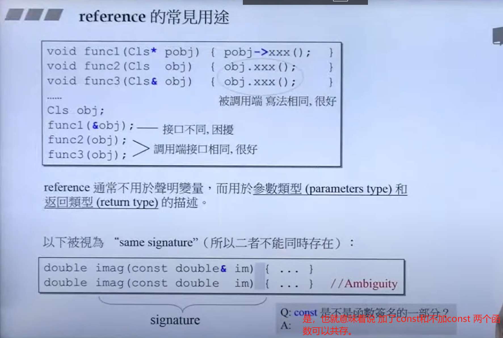
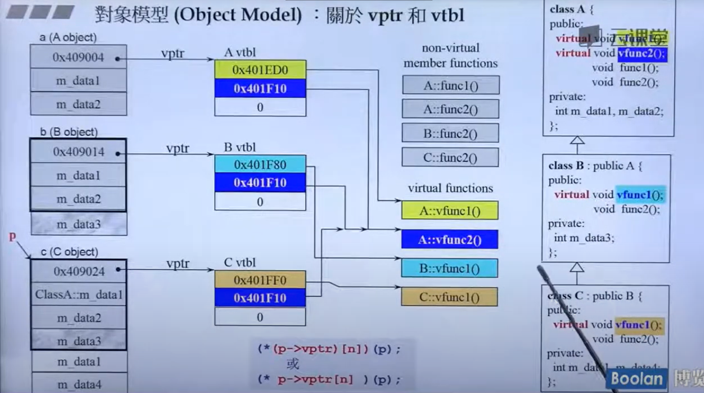
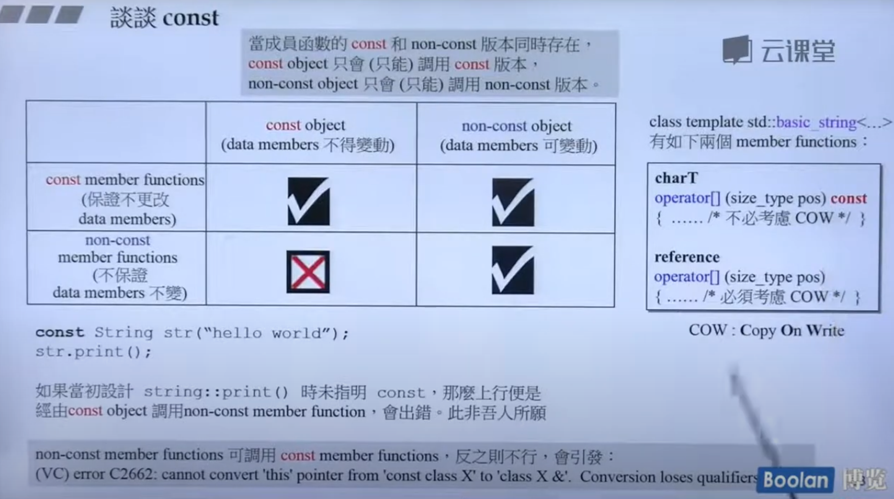

+ 视频直达：[C++ 面向对象高级编程下-兼谈对象模型](https://www.bilibili.com/video/BV1ZX4y157Bu)
+ 课程讲义下载直达：[slide](slide/)
+ 源代码直达：[code](code/)

----

候捷老师 C++ 系列课程导航：（编号顺序可作为学习顺序参考）

1. [C++面向对象高级编程（上）-基于对象和面向对象](../C++-OOPBase1-HouJie/)
2. C++面向对象高级编程（下）-兼谈对象模型
3. [C++标准库(STL)与泛型编程](../C++-STL-HouJie/)
4. [C++新标准-C++11/14](../C++-newC++11&14-HouJie/)
5. [C++内存管理](../C++-MemoryManagement-HouJie/)
6. [C++Startup揭秘](https://github.com/19PDP/Bilibili-plus)


---

## 课程简介

这是侯捷老师的所有C++技术课程中最基础最根本的一门课。

C++可说是第一个高度普及的Object-Oriented（面向对象）程序语言。“第一个”
或“最早的”并非重点，重点是经过多年的淬炼和考验C++的影响深入各层面，
拥有众多使用者和极其丰富的资源（书籍、论文、期刊、视频、第三方程序库…）。

作为Object-Oriented（面向对象）技术的主流语言，C++其实还拥有另一支编程
主线：模板与泛型编程（Templates and Generic Programming）。

本课程涵盖上述两条主线：Object-Oriented（面向对象）和泛型编程（Generic
Programming）。

由于视频录制时程的因素，本课程分为Part I和Part II.
Part I主要讨论OO（面向对象）的基础概念和编程手法。基础最是重要，勿在浮
沙筑高台，着重的是大器与大气。课程首先探讨Class without pointer members
和Class with pointer members两大类型，而后晋升至OOP/OOD，包括classes之
间最重要的三种关系：继承（Inheritance）、复合（Composition）、委托（Delegation）。
Part II继续探讨更多相关主题，并加上低阶的对象模型（Object Model），以及高
阶的Templates（模板）编程。

本课程所谈主题都隶属C++1.0（C++98）；至于C++ 2.0（C++11/14）带来的崭新
内容则由侯捷老师的 [另一门课程](../C++-newC++11&14-HouJie) 涵盖。C++2.0在语言和标准库两方面都带来了很多新
事物，份量足以形成另一门课程。

你将获得整个video课程的完整讲义（也就是video呈现的每一张投影片画面），
和完整的示例程序。你可以（也有必要）在学习过程中随时停下来思考和阅读讲义。

> 侯捷简介：程序员，软件工程师，台湾工研院副研究员，教授，专栏主笔。曾任
> 教于中坜元智大学、上海同济大学、南京大学。著有《无责任书评》三卷、《深
> 入浅出MFC》、《STL源码剖析》…，译有《Effective C++》《More Effective C++》
> 《C++ Primer》《The C++ Standard Library》…


---

以下这份不太细致的主题划分，帮助您认识整个课程内容。

## C++面向對象編程 (C++Object-Oriented Programming)

### Part I

**Introduction of C++98, TR1, C++11, C++14**<br>
&emsp;Bibliography<br>
&emsp;Data and Functions, from C to C++<br>
&emsp;Basic forms of C++ programs<br>
&emsp;About output<br>
&emsp;Guard declarations of header files<br>
&emsp;Layout of headers<br>
&emsp;Object Based<br>
&emsp;Class without pointer member<br>
&emsp;&emsp;Class declarations<br>
&emsp;&emsp;Class template, introductions and overviews<br>
&emsp;&emsp;What is 'this'<br>
&emsp;&emsp;Inline functions<br>
&emsp;&emsp;Access levels<br>
&emsp;&emsp;Constructor (ctor)<br>
&emsp;&emsp;Const member functions<br>
&emsp;&emsp;Parameters : pass by value vs. pass by reference<br>
&emsp;&emsp;Return values : return by value vs. return by reference<br>
&emsp;&emsp;Friend<br>
&emsp;&emsp;Definitions outside class body<br>
&emsp;&emsp;Operator overloading, as member function<br>
&emsp;&emsp;Return by reference, again<br>
&emsp;&emsp;Operator overloading, as non-member function<br>
&emsp;&emsp;Temporary objects<br>
&emsp;&emsp;Expertise<br>
&emsp;&emsp;Code demonstration<br>
&emsp;class with pointer members<br>
&emsp;&emsp;The "Big Three"<br>
&emsp;&emsp;&emsp;Copy Constructor<br>
&emsp;&emsp;&emsp;Copy Assignment Operator<br>
&emsp;&emsp;&emsp;Destructor<br>
&emsp;&emsp;Ctor and Dtor, in our String class<br>
&emsp;&emsp;"MUST HAVE" in our String class<br>
&emsp;&emsp;&emsp;Copy Constructor<br>
&emsp;&emsp;&emsp;Copy assignment operator<br>
&emsp;&emsp;Deal with "self assignment"<br>
&emsp;&emsp;Another way to deal with "self assignment" : Copy and Swap<br>
&emsp;&emsp;Overloading output operator (<<)<br>
&emsp;&emsp;Expertise<br>
&emsp;&emsp;Code demonstration<br>
&emsp;Objects from stack vs. objects from heap<br>
&emsp;&emsp;Objects lifetime<br>
&emsp;&emsp;new expression : allocate memory and then invoke ctor<br>
&emsp;&emsp;delete expression : invoke dtor and then free memory<br>
&emsp;&emsp;Anatomy of memory blocks from heap<br>
&emsp;&emsp;Allocate an array dynamically<br>
&emsp;&emsp;new[] and delete[]<br>
&emsp;MORE ISSUES :<br>
&emsp;&emsp;static<br>
&emsp;&emsp;private ctors<br>
&emsp;&emsp;cout<br>
&emsp;&emsp;Class template<br>
&emsp;&emsp;Function template<br>
&emsp;&emsp;namespace<br>
&emsp;&emsp;Standard Library : Introductions and Overviews<br>
&emsp;Object Oriented<br>
&emsp;&emsp;Composition means "has-a"<br>
&emsp;&emsp;&emsp;Construction : from inside to outside<br>
&emsp;&emsp;&emsp;Destruction : from outside to inside<br>
&emsp;&emsp;Delegation means "Composition by reference"<br>
&emsp;&emsp;Inheritance means "is-a"<br>
&emsp;&emsp;&emsp;Construction : from inside to outside<br>
&emsp;&emsp;&emsp;Destruction : from outside to inside<br>
&emsp;&emsp;Construction and Destruction, when Inheritance+Composition<br>
&emsp;&emsp;Inheritance with virtual functions<br>
&emsp;&emsp;Virtual functions typical usage 1 : Template Method<br>
&emsp;&emsp;Virtual functions typical usage 2 : Polymorphism<br>
&emsp;&emsp;Virtual functions inside out : vptr, vtbl, and dynamic binding<br>
&emsp;&emsp;Delegation + Inheritance : Observer<br>
&emsp;&emsp;Delegation + Inheritance : Composite<br>
&emsp;&emsp;Delegation + Inheritance : Prototype<br>

### Part II

**绪论**<br>
- Conversion function（转换函数）<br>
- Non-explicit one-argument constructor<br>
- Pointer-like classes，关于智能指针<br>
- Pointer-like classes，关于迭代器<br>
- Function-like classes，所谓仿函数<br>
- 标准库中的仿函数的奇特模样<br>
- namespace经验谈<br>
- class template，类模板<br>
- function template，函数模板<br>
- member template，成员模板<br>
- specialization，模板特化<br>
- partial specialization，模板偏特化——个数的偏<br>
- partial specialization，模板偏特化——范围的偏<br>
```cpp
//偏特化分为两种：个数的偏特化和范围的偏特化
//偏特化是指对模板中的某些参数进行特化，而不是对所有参数进行特化
//特化主要是在泛化的过程当中会有一些特殊情况，特化就是为解决这些特殊情况而出现的。
#include<iostream>
using namespace std;

//完全特化
template<class key>
struct specialization { 
    
};

template<>
struct specialization<char>
{
    char operator() (char p){ return p;}
};

//偏特化与完全特化不同，完全特化是为特定类型提供完全不同的实现，而偏特化则是为一部分类型提供不同的实现。
//范围的偏特化，对原先的所有类型到 用一个指针指向某个类型
template<typename T>
struct C{   //原先的泛化是一个元素
    // ...  
};
template<typename T>
struct C<T*>{   //这里限定到指针，也可以是const 等等
    // ...
};

//数量上的偏特化, 语法如下
//针对到某个typename 需要改变，但是另一个可以不用改变
template<typename T,typename Alloc=/*....*/>
struct vector{
    // ...  
};

template<typename Alloc=/**/>
struct vector<bool, Alloc>{
    //...
}

```
- template template parameter，模板模板参数<br>

~~这个好难www~~
```cpp
//写法类似如下

//第一种写法----Encoder: UTF-8
#include<iostream>
#include<vector>
using namespace std;

template<class T, template<typename U1, typename U2> 
               class Container>// 这里其实限定了传进来的第二个类型必须是模板，并且模板所需要的参数只能有两个
class Xcls{
private:
    Container<T, std::allocator<T>> c;
public:
    Xcls(): c(Container<T, std::allocator<T>>()) {  }
};
int main()
{
    Xcls<char, vector> pv; 
    cout <<"Compile Success" << endl;
    return 0;
}

//第二种写法----Encoder:UTF-8
//
template<class T, template<typename U1> 
               class Container> // 第二个参数必须是一个模板类
class Xcls{
private:
    Container<T> c;
public:
    Xcls(): c(Container<T>()) {  }
};

template<typename T>
class A { };

int main()
{
    // Xcls<char, vector> pv; //类模板 "std::vector" 与 模板 template 参数 "Container" 不兼容
    Xcls<char, A> pa;
    //自己实现模板类的可以编译，但是STL标准模板库当中就不行!
    cout <<"Compile Success" << endl;
    return 0;
}


// 最后看一个 不是模板模板参数的例子
// 模板模板参数的关键是一个类的模板参数 也是一个模板，
// 但是在下面stack当中 第二个类型参数传递进来的时候，其实已经确定了类型是什么了，是一个确定的类型参数，而不是模板参数。
// 所以不是模板
template <class T, class Sequence = deque<T>>
class stack{
    friend bool operator== <> (const stack&, const stack&);
    friend bool operator< <> (const stack&, const stack&);
    
protected:
    Sequence c;
}

```

- variadic templates（since C++11）<br>
```cpp
void print(){
    
}

template<typename T,typename... Types>
void print(const T& first, const Types&... args){
    cout<< first <<endl;
    print(args);
}
//语法糖系列之一，模板参数数量可变
```
- auto（since C++11）<br>
```cpp
// 又是一个新的语法糖 auto
// 使用的时候必须是能够立即给变量赋值的
list<int> c;
// ...
auto a = find(c.begin(), c.end(), target);

auto b;
b = find(c.begin(), c.end(), target);
```

ranged-base for（since C++11）<br>

reference<br>

```cpp
//reference是指代表的意思
//const是函数签名的一部分呢，也就是说，两个函数如果函数参数相同，但是一个加了const，另一个没有加上const，就是两个不一样的函数，可以共存。
#include<iostream>

using namespace std;

double imag(const double& im){
    cout<<"reference "<<im<<endl;
}
double imag(const double im) 
{
    cout<<"value "<<im<<endl;
}

int main(){

    imag(3.14);// 多个 重载函数 "imag" 实例与参数列表匹配:C/C++(308)

    // reference更像是一个代表，
    // 当指定了一个变量a引用另一个变量b的时候，这个时候a就b绑定死了，不能再去引用其他变量了
    int b = 10;
    int& a = b;
    int c = 100;
    a = c;  //不能再变化引用的对象了，所以这里是单纯的赋值
    cout<<"a is "<<a<<" b is "<<b<<" c is "<<c<<endl;
    return 0;
}
```

- Composition（复合）关系下的构造和析构<br>
- Inheritance（继承）关系下的构造和析构<br>
- Inheritance+Composition关系下的构造和析构<br>
- 对象模型（Object Model）：关于vptr和vtbl<br>

```cpp
//老师课堂上给出的的模型代码示例
//产生多态的三个条件缺一不可:
/*
1. 通过指针调用类函数
2. 必须是up-cast，也就是基类的指针指向子类的new 创建的对象，只要是指向子类的指针就可以
3. 必须是调用virtual function, 所以必须要有virtual function的存在，


继承对于类方法是调用权的继承，只有加入了virtual 关键字的函数
才能被子类继承下去(前提是子类也实现了这个虚函数)，在多态的产生当中调用的就是子类实现的方法，如果子类没有实现，那就需要回到父类看是否实现，找一个离自己当前类最近的父类查看是否实现，如果有就选最近的父类实现函数。

*/

#include<iostream>
#include<list>
using namespace std;

class A{
public:
    virtual void vfunc1() { cout<< "this is A's vfunc1 "<<endl; }
    virtual void vfunc2() { cout<< "this is A's vfunc2 "<<endl; }
    void func1() { cout<< "this is A's func1"<<endl; }
    void func2() { cout<< "this is A's func2"<<endl; }
private:
    int m_data1, m_data2;
};

class B : public A{
public:
    void vfunc1() override {
        cout<< "this is B's vfunc1" << endl;
    }
    void func2() {
        cout<< "this is B'func2"<<endl;
    }
private:
    int m_data3;
};

class C: public B{
public:
    virtual void vfunc1(){
        cout<< "this is C's vfunc2 "<<endl;
    }

    // @override
    void func1(){
        cout<< "this is C's func1 "<<endl;
    }

private:
    int m_data4;
};

int main(int argc, char const *argv[])
{
    A a = C();  // 不通过指针调用子类，不会产生虚指针的用途。
    A* ap = new C();
    ap->func1();
    ap->func1();
    ap->vfunc1();
    ap->vfunc2();
    // 查看对象 a 的虚指针内容
    void** vptr_a = (void**)(void*)&a;
    cout << "vptr of a: " << vptr_a << endl;

    // 查看指针 ap 的虚指针内容
    void** vptr_ap = (void**)(void*)ap;
    cout << "vptr of ap: " << vptr_ap << endl;
    cout << ((vptr_ap)[0]) << endl;

    cout<<" sizeof(a) is " <<sizeof(a)<<endl;
    cout<<" sizeof(ap) is "<<sizeof(ap)<<endl;

    return 0;
}

```

- 对象模型（Object Model）：关于this<br>
- 对象模型（Object Model）：关于Dynamic Binding<br>
- 谈谈const<br>
**当一个类的某个成员函数 既有 const版本, 也有non-const版本的时候那么只有const对象才能调用 const版本的成员函数，non-const的对象才能调用non-const版本的成员函数，这样的规定是为了保证在不同的情况下实现不同的功能**

```cpp

// 当一个类的某个成员函数 既有 const版本, 也有non-const版本的时候
// 那么只有const对象才能调用 const版本的成员函数，non-const的对象才能调用non-const版本的成员函数，这样的规定是为了保证在不同的情况下实现不同的功能
//如下所示，在对字符串操作的时候，往往多个相同内容的字符串变量是共享同一个字符串的地址
//但是如果其中一个变量想要对字符串进行修改，就需要进行拷贝字符串到一个新的位置然后再修改写的操作，
//这样的话就必须调用non-const的成员函数，才能实现。
char T
operator[] (size_type pos) const
{.... /* 不考虑Copy on Write */} 

operator[] (size_type pos)
{.... /* 必须考虑Copy on Write*/}

```

- 关于new，delete<br>
- 重载 ::operator new，::operator delete<br>
- 重载 ::operator new[]，::operator delete[]<br>
- 重载 member operator new/delete<br>
- 重载 member operator new[]/delete[]<br>
```cpp
#include <iostream>
using namespace std;

/*
operator new 调用情况，使用表达式的new 的时候会调用operator new
如：
body* a = new body();
这句话等效于如下三个
void* p = operator new(sizeof(body));
p = static_cast(body*)(p);
p->body::body();        //调用构造函数

delete a; 等效于如下两行
a->~body();
operator delete(a);

*/

// 设计一个 重载了operator new和 operator delete的类
class body
{
public:
    body() : h(0) {}
    body(int h) : h(h) {}

    void *operator new(size_t size)
    {
        printf("Through body's operator new!\n");
        return malloc(size);
    }

    void *operator new[](size_t size)
    {
        printf("Through body's operator new[]\n");
        return malloc(size);
    }

    void operator delete(void *f, size_t size)
    {
        printf("through body's operator delete!\n");
        free(f);
    }

    void operator delete[](void *f, size_t size_t)
    {
        printf("Through body's operator delete[]\n");
        free(f);
    }

private:
    int h;
};

void test_overload_operator_new_and_array_new();

int main()
{
    body a;      // 没有经过operator delete 函数
    body &b = a; // 没有经过operator new函数

    body *c = new body(); // 触发operator new函数
    delete c;             // 触发operator delete函数

    body *clist = new body[3];
    delete[] clist;

    test_overload_operator_new_and_array_new();

    return 0;
}
```
- 示例<br>
- 重载new()，delete()<br>
- 示例<br>
- basic_string使用new（extra）扩充申请量

-- the end

