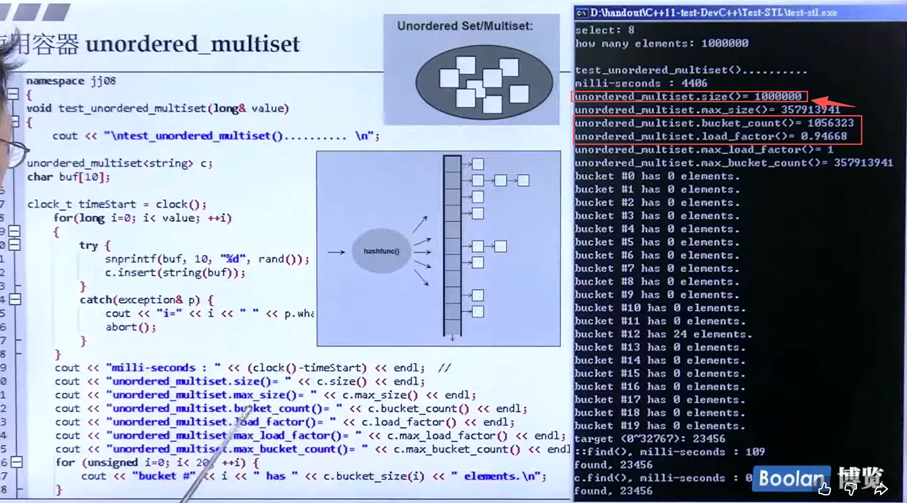
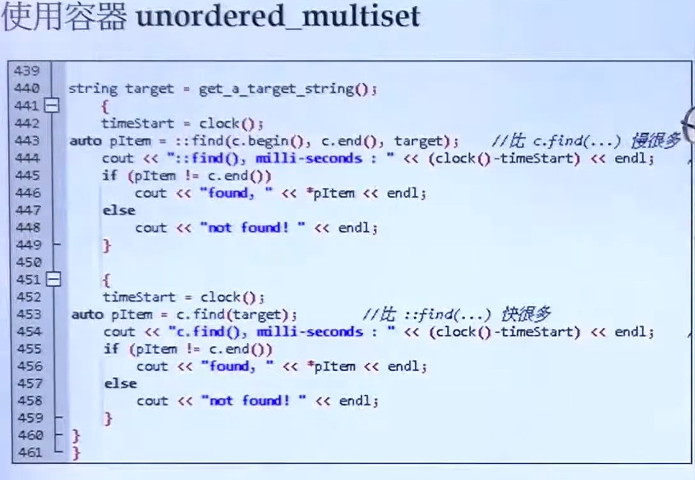
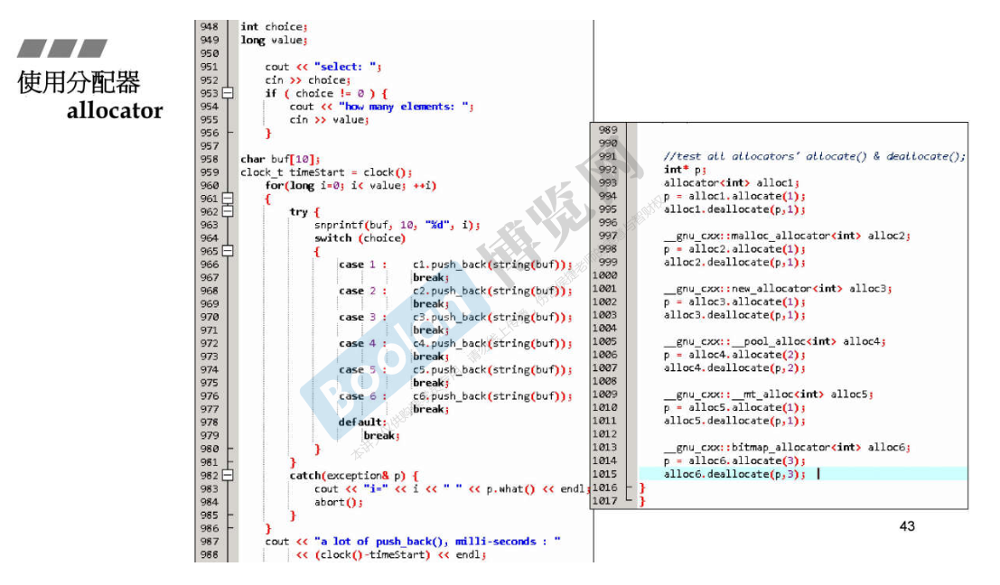
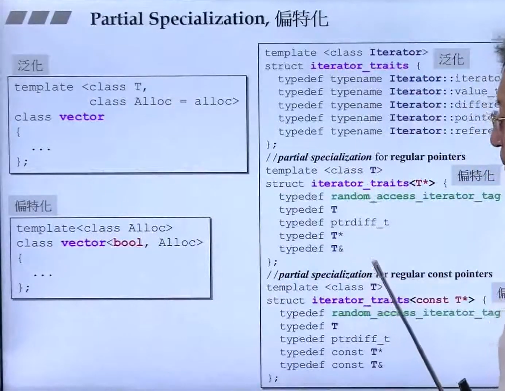
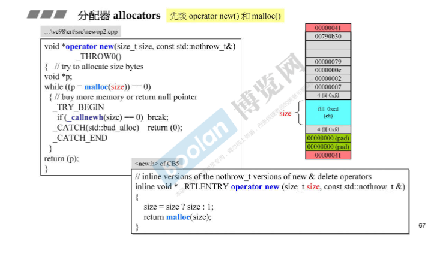
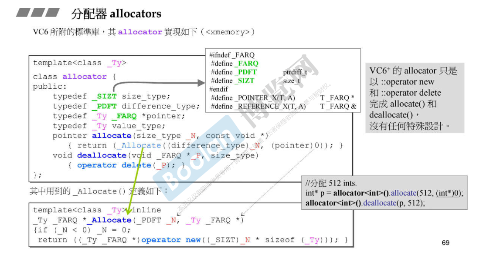

- `vector`的扩展方式是两倍扩展，也就是只有当`vector`的容量已满，此时再存放元素空间不够的时候，此时的`vector`的容器容量会扩充为原来的二倍。也就是`vector.capactiy` 扩展为原来的二倍

- `multimap`不可以用`[]`做 `insertion`，具体做插入的方式是`multimap<type1, type 2>.insert(pair<type1,type2>(i,buf));`。但是如果是`map`就可以使用`map[key] = value`这种方式做插入。
   
- unordered_multiset结构图
> 底层的实现原理是使用哈希表，所以这里显示了装填因子，解决散列冲突的方式是`拉链法`，即当冲突产生的时候就让元素积聚在一个“篮子”，拉成一个链表。但是需要强调的是**篮子的数量一定是要比放入的元素数量多，扩增的规律和`vector`相似，也就是当放入的元素数量要超过篮子的数量的时候，篮子的数量会扩增为原来的二倍**

> 使用通用的全局的`::find`函数要比使用`class.find()`容器类自身实现的`find`函数要慢很多很多。这一点对于其他容器也是同理的，**如果一个类自身实现了`find`函数，那么就尽可能使用自己实现的`find`函数而不要调用全局的`find`函数**。

- allocator-分配器的使用

> 使用`allocator`分配器是专门可以用来分配和回收内存空间的，但是它只是适合跟`container`容器搭配，在容器的背后做内存的分配和回收。它并不适合单独拿出来像`malloc`或者`new`一样做内存的分配，因为它的使用需要指明分配和回收的内存空间的大小。

- `GP泛型编程`与`OOP编程`的不同点在于，`GP编程`是会将方法和数据分离，这个在`STL`的实现当中使用广泛。这里的方法就是`Algorithm`算法，数据也就是`Container`容器，二者的链接工具就是`Iterator`迭代器。

- 模板泛化，特化，偏特化

> 泛化就是模板编程，模板中的参数全是需要指定的，没有固定的参数。特化就是在泛化的模板类型当中特殊的执行如果模板参数是某些特殊类型的话就要用专门实现的代码来实现。偏特化是指模板当中的参数一部分是需要指定的，一部分是已经确定的。

- allocator实现方式

> `allocator`底层最重要的两个函数是`allocate`函数和`deallocate`函数，其中`allocate`负责分配内存，使用`operator new`分配内存，分配得到的内存往往真实数据的大小要小于全部得到的内存，也就是说存在`overhead memory`，这部分内存的大小往往要高于实际数据的大小。
> 还有就是`deallocate`负责释放内存，底层使用`operator delete`删除。不推荐使用`allocator`做内存分配，很繁琐，但是需要了解不同分配器对STL容器的影响关系，选择适合的分配器给STL容器。

